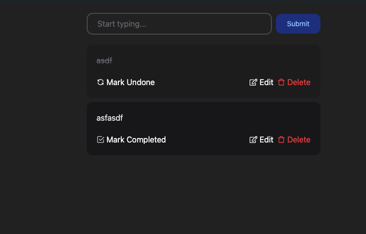

<!-- PROJECT LOGO -->
 

## Introduction

Welcome to the GitHub repository for this simple classic Todo Application with
TypeScript!

In the evolving JavaScript landscape, TypeScript is becoming increasingly
popular, particularly among React developers. In this project, I leveraged
TypeScript to enhance my skills by creating a classic todo app. To improve the
app's aesthetics, I incorporated Tailwind CSS and Framer Motion. Additionally, I
implemented local storage and cookies to persist data for each todo item,
ensuring a seamless user experience.

View this project [here](https://todo-app-typescript-bay.vercel.app/)!

